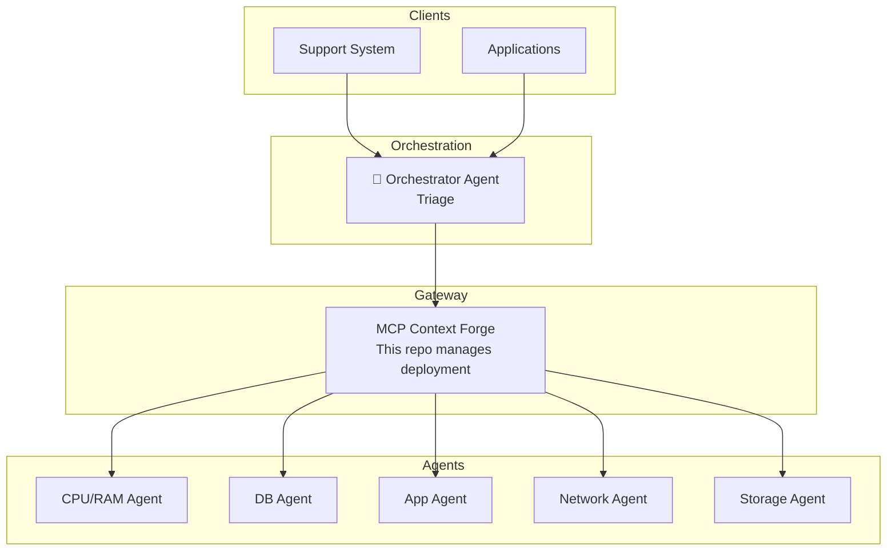

# TCloud MCP Platform - Project Overview

## Purpose
Centralized platform for orchestrating MCP (Model Context Protocol) Agents in the TCloud ecosystem. Manages the MCP Context Forge gateway deployment and provides templates for teams to create new agents.

## Tech Stack
- **Infrastructure**: Kubernetes, Helm
- **Gateway**: MCP Context Forge (IBM)
- **Agent Template**: Python 3.12, Docker
- **Database**: PostgreSQL (for Context Forge)
- **Cache**: Redis (for federation/caching)

## Architecture



## Project Structure

```
tcloud-mcp-platform/
├── infrastructure/           # Context Forge deployment
│   └── context-forge/
│       ├── values.yaml       # Base Helm config
│       ├── values-dev.yaml   # Dev overrides
│       └── values-prod.yaml  # Prod overrides
├── templates/                # Agent templates for teams
│   └── mcp-agent-docker/     # Docker-based template
├── docs/                     # Documentation
│   ├── architecture.md
│   ├── creating-agents.md
│   └── getting-started.md
├── scripts/                  # Automation scripts
├── Makefile                  # Common commands
└── README.md
```

## Environments

| Environment | Namespace | Gateway URL |
|-------------|-----------|-------------|
| Dev | mcp-dev | https://mcp-gateway.tbf8b9d.k8s.sp06.te.tks.sh |
| Prod | mcp | https://mcp-gateway.tcloud.internal (planned) |

### Dev Environment Details (Cluster tbf8b9d)
- **Admin UI**: https://mcp-gateway.tbf8b9d.k8s.sp06.te.tks.sh/admin/login
- **Health**: https://mcp-gateway.tbf8b9d.k8s.sp06.te.tks.sh/health
- **Ingress**: Public controller (.223), no ingressClassName
- **Credentials**: 
  - Email: admin@example.com
  - Password: `kubectl -n mcp-dev get secret mcp-stack-gateway-secret -o jsonpath="{.data.BASIC_AUTH_PASSWORD}" | base64 -d`

## Authentication Plugin

| Plugin | Purpose | Status |
|--------|---------|--------|
| tcloud_cognito_auth | JWT validation via Cognito + TCloud API permissions | ✅ Implemented |

**Location:** `plugins/tcloud_cognito_auth/`

**Headers Propagated:**
- `X-User-Email` - User email
- `X-User-Customers` - JSON array of cloud_ids

## Registered Agents

| Agent | URL | Status |
|-------|-----|--------|
| tcloud-watch-mcp-server | https://api.tcloud-watch-mcp.example.com/mcp | ✅ Registrado |

## Related Repositories

- [tcloud-watch-mcp-server](https://github.com/tcloud-dev/tcloud-watch-mcp-server) - CPU/RAM Agent
- [MCP Context Forge](https://github.com/IBM/mcp-context-forge) - Gateway (upstream)
