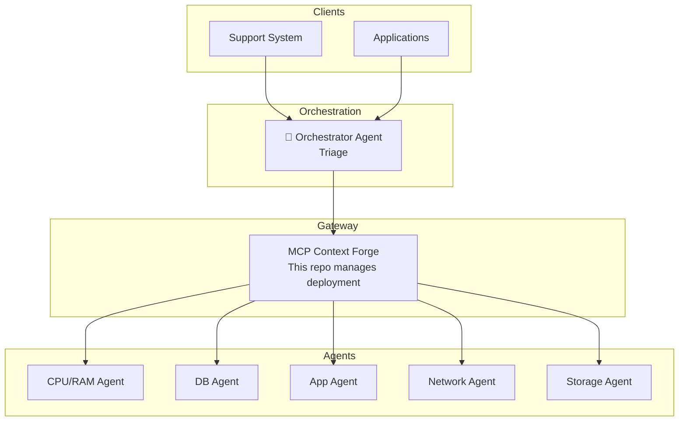

# TCloud MCP Platform - Project Overview

## Purpose
Centralized platform for orchestrating MCP (Model Context Protocol) Agents in the TCloud ecosystem. Manages the MCP Context Forge gateway deployment and provides templates for teams to create new agents.

## Tech Stack
- **Infrastructure**: Kubernetes, Helm
- **Gateway**: MCP Context Forge (IBM)
- **Agent Template**: Python 3.12, Docker
- **Database**: PostgreSQL (for Context Forge)
- **Cache**: Redis (for federation/caching)

## Architecture



## Project Structure

```
tcloud-mcp-platform/
├── infrastructure/           # Context Forge deployment
│   └── context-forge/
│       ├── values.yaml       # Base Helm config
│       ├── values-dev.yaml   # Dev overrides
│       └── values-prod.yaml  # Prod overrides
├── templates/                # Agent templates for teams
│   └── mcp-agent-docker/     # Docker-based template
├── docs/                     # Documentation
│   ├── architecture.md
│   ├── creating-agents.md
│   └── getting-started.md
├── scripts/                  # Automation scripts
├── Makefile                  # Common commands
└── README.md
```

## Environments

| Environment | Namespace | Gateway URL |
|-------------|-----------|-------------|
| Dev | mcp-dev | https://mcp-gateway.tbf8b9d.k8s.sp06.te.tks.sh |
| Prod | mcp | https://mcp-gateway.tcloud.internal (planned) |

### Dev Environment Details (Cluster tbf8b9d)
- **Admin UI**: https://mcp-gateway.tbf8b9d.k8s.sp06.te.tks.sh/admin/login
- **Health**: https://mcp-gateway.tbf8b9d.k8s.sp06.te.tks.sh/health
- **Ingress**: Public controller (.223), no ingressClassName
- **Credentials**: 
  - Email: admin@example.com
  - Password: `kubectl -n mcp-dev get secret mcp-stack-gateway-secret -o jsonpath="{.data.BASIC_AUTH_PASSWORD}" | base64 -d`

## Registered Agents

| Agent | URL | Status |
|-------|-----|--------|
| (none) | - | Need to re-register after clean reinstall on 2026-02-26 |

## Known Issues & Workarounds

### Ingress: chart always renders ingressClassName
The mcp-context-forge Helm chart always renders `ingressClassName` in the ingress spec.
In the tbf8b9d cluster, the public ingress controller (.223) has no IngressClass, so we need to:
1. Set `className: ""` in values-dev.yaml
2. After deploy, patch: `kubectl patch ingress mcp-stack-ingress -n mcp-dev --type=json -p='[{"op": "remove", "path": "/spec/ingressClassName"}]'`

### Redis config: inline comments break Redis 8.6+
The chart generates `save` directives with inline comments (e.g., `save 900 1 # comment`).
Redis 8.6+ rejects these. If Redis enters CrashLoopBackOff, patch the configmap to remove inline comments.

### Postgres password drift
The Makefile generates random passwords on each deploy. If Postgres already exists with a different password,
the migration job will fail with auth errors. Always pass the existing Postgres password:
```bash
PASS=$(kubectl exec <postgres-pod> -n mcp-dev -- printenv POSTGRES_PASSWORD)
helm upgrade ... --set postgres.credentials.password="$PASS"
```

## Related Repositories

- [tcloud-watch-mcp-server](https://github.com/tcloud-dev/tcloud-watch-mcp-server) - CPU/RAM Agent
- [MCP Context Forge](https://github.com/IBM/mcp-context-forge) - Gateway (upstream)
