# TCloud MCP Platform - Project Overview

## Purpose
Centralized platform for orchestrating MCP (Model Context Protocol) Agents in the TCloud ecosystem. Manages the MCP Context Forge gateway deployment and provides templates for teams to create new agents.

## Tech Stack
- **Infrastructure**: Kubernetes, Helm
- **Gateway**: MCP Context Forge (IBM)
- **Agent Template**: Python 3.12, Docker
- **Database**: PostgreSQL (for Context Forge)
- **Cache**: Redis (for federation/caching)

## Architecture

```mermaid
flowchart TB
    subgraph Clients
        C1[Support System]
        C2[Applications]
    end

    subgraph Orchestration
        OA[🧠 Orchestrator Agent<br/>Triage]
    end

    subgraph Gateway
        MCF[MCP Context Forge<br/>This repo manages deployment]
    end

    subgraph Agents
        A1[CPU/RAM Agent]
        A2[DB Agent]
        A3[App Agent]
        A4[Network Agent]
        A5[Storage Agent]
    end

    C1 --> OA
    C2 --> OA
    OA --> MCF
    MCF --> A1
    MCF --> A2
    MCF --> A3
    MCF --> A4
    MCF --> A5
```



## Project Structure

```
tcloud-mcp-platform/
├── infrastructure/           # Context Forge deployment
│   └── context-forge/
│       ├── values.yaml       # Base Helm config
│       ├── values-dev.yaml   # Dev overrides
│       └── values-prod.yaml  # Prod overrides
├── templates/                # Agent templates for teams
│   └── mcp-agent-docker/     # Docker-based template
├── docs/                     # Documentation
│   ├── architecture.md
│   ├── creating-agents.md
│   └── getting-started.md
├── scripts/                  # Automation scripts
├── Makefile                  # Common commands
└── README.md
```

## Environments

| Environment | Namespace | Gateway URL |
|-------------|-----------|-------------|
| Dev | mcp-dev | https://mcp-gateway.tbf8b9d.k8s.sp06.te.tks.sh |
| Prod | mcp | https://mcp-gateway.tcloud.internal (planned) |

### Dev Environment Details (Cluster tbf8b9d)
- **Admin UI**: https://mcp-gateway.tbf8b9d.k8s.sp06.te.tks.sh/admin/login
- **Health**: https://mcp-gateway.tbf8b9d.k8s.sp06.te.tks.sh/health
- **Ingress**: Public controller (.223), no ingressClassName
- **Credentials**: 
  - Email: admin@example.com
  - Password: `kubectl -n mcp-dev get secret mcp-stack-gateway-secret -o jsonpath="{.data.BASIC_AUTH_PASSWORD}" | base64 -d`

## Authentication Plugin

| Plugin | Purpose | Status |
|--------|---------|--------|
| tcloud_cognito_auth | JWT validation via Cognito + TCloud API permissions | ✅ Deployed |

**Location:** `plugins/tcloud_cognito_auth/`

**Docker Image:** `ghcr.io/tcloud-dev/mcp-context-forge:with-auth`

**Headers Propagated:**
- `X-User-Email` - User email
- `X-User-Customers` - JSON array of cloud_ids

**Plugin Hooks:**
- `http_auth_resolve_user` - Validates JWT and fetches permissions
- `agent_pre_invoke` - Injects user context headers

## Registered Agents

| Agent | URL | Status |
|-------|-----|--------|
| tcloud-watch-mcp-server | https://api.tcloud-watch-mcp.example.com/mcp | ✅ Registrado |

## Configuration Notes

### Ingress (Dev Environment)
- **DO NOT** set `ingressClassName` in values-dev.yaml
- External ingress controller (201.157.216.223) picks up ingresses without className
- Internal ingress (201.157.216.224) has IP source restrictions
- TLS should be `false` - external ingress handles HTTPS automatically with wildcard cert

### Redis 8.4 Compatibility
- Redis 8.4 does not accept inline comments on config lines
- If redis crashes with "Invalid save parameters", check the configmap:
  ```bash
  kubectl -n mcp-dev get cm mcp-stack-redis-config -o yaml
  ```
- Fix: Move comments to separate lines (not `save 900 1 # comment`)

### Helm Migration Job
- If deploy fails with "mcp-stack-migration job InProgress":
  ```bash
  kubectl -n mcp-dev delete job mcp-stack-migration
  helm upgrade ... --no-hooks
  ```

### Postgres Password
- Helm generates random passwords on each deploy
- If postgres fails authentication, patch with original password:
  ```bash
  kubectl -n mcp-dev patch secret postgres-secret -p '{"data":{"POSTGRES_PASSWORD":"'$(echo -n 'ORIGINAL_PASSWORD' | base64)'"}}'
  ```

## Related Repositories

- [tcloud-watch-mcp-server](https://github.com/tcloud-dev/tcloud-watch-mcp-server) - CPU/RAM Agent
- [MCP Context Forge](https://github.com/IBM/mcp-context-forge) - Gateway (upstream)
