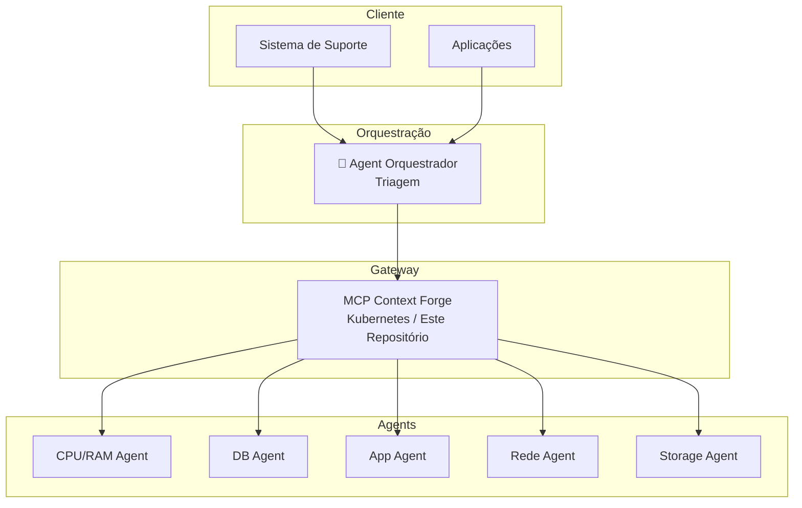

# TCloud MCP Platform

Plataforma centralizada para orquestração de Agents MCP (Model Context Protocol) no ecossistema TCloud.

## Arquitetura



## Estrutura do Repositório

```
tcloud-mcp-platform/
├── infrastructure/           # Deploy do MCP Context Forge
│   └── context-forge/
│       ├── values.yaml       # Configuração base
│       ├── values-dev.yaml   # Overrides para dev
│       └── values-prod.yaml  # Overrides para prod
├── templates/                # Templates para criar novos Agents
│   └── mcp-agent-docker/     # Template Docker (recomendado)
├── docs/                     # Documentação
├── scripts/                  # Scripts de automação
├── Makefile                  # Comandos úteis
└── README.md
```

## Quick Start

### 1. Deploy do MCP Context Forge

```bash
# Pré-requisitos
kubectl get storageclasses
kubectl get ingressclass

# Deploy
make deploy-context-forge ENV=dev
```

### 2. Criar um novo Agent MCP

```bash
# Usar o template
make new-agent NAME=my-agent

# Isso cria um novo repositório baseado no template
```

### 3. Registrar Agent no Context Forge

```bash
make register-agent NAME=my-agent URL=https://my-agent.example.com/mcp
```

## Agents Disponíveis

| Agent | Repositório | Status | Descrição |
|-------|-------------|--------|-----------|
| CPU/RAM | [tcloud-watch-mcp-server](https://github.com/tcloud-dev/tcloud-watch-mcp-server) | ✅ Ativo | Diagnóstico de CPU e RAM |
| Orquestrador | tcloud-orchestrator-mcp | 📋 Planejado | Triagem e consolidação |
| Database | tcloud-db-mcp | 📋 Planejado | Diagnóstico de banco de dados |
| Aplicação | tcloud-app-mcp | 📋 Planejado | Diagnóstico de ERP/aplicações |
| Rede | tcloud-network-mcp | 📋 Planejado | Diagnóstico de conectividade |

## Criando um Novo Agent

Veja a documentação completa em [docs/creating-agents.md](docs/creating-agents.md).

### Resumo

1. **Use o template**: `make new-agent NAME=meu-agent`
2. **Implemente suas tools** em `src/tools.py`
3. **Implemente seus prompts** em `src/prompts.py`
4. **Build e deploy**: `docker build && docker push`
5. **Registre no Context Forge**: `make register-agent`

## Ambientes

| Ambiente | Context Forge URL | Namespace |
|----------|-------------------|-----------|
| Dev | https://mcp-gateway.tbf8b9d.k8s.sp06.te.tks.sh | mcp-dev |
| Prod | https://mcp-gateway.tcloud.internal (planejado) | mcp |

## Referências

- [MCP Context Forge](https://github.com/IBM/mcp-context-forge)
- [MCP Protocol Spec](https://modelcontextprotocol.io/)
- [Anthropic MCP SDK](https://github.com/modelcontextprotocol/python-sdk)

## Contribuindo

1. Crie uma branch: `git checkout -b feature/meu-agent`
2. Faça suas alterações
3. Abra um PR para review

## Licença

Proprietary - TOTVS
